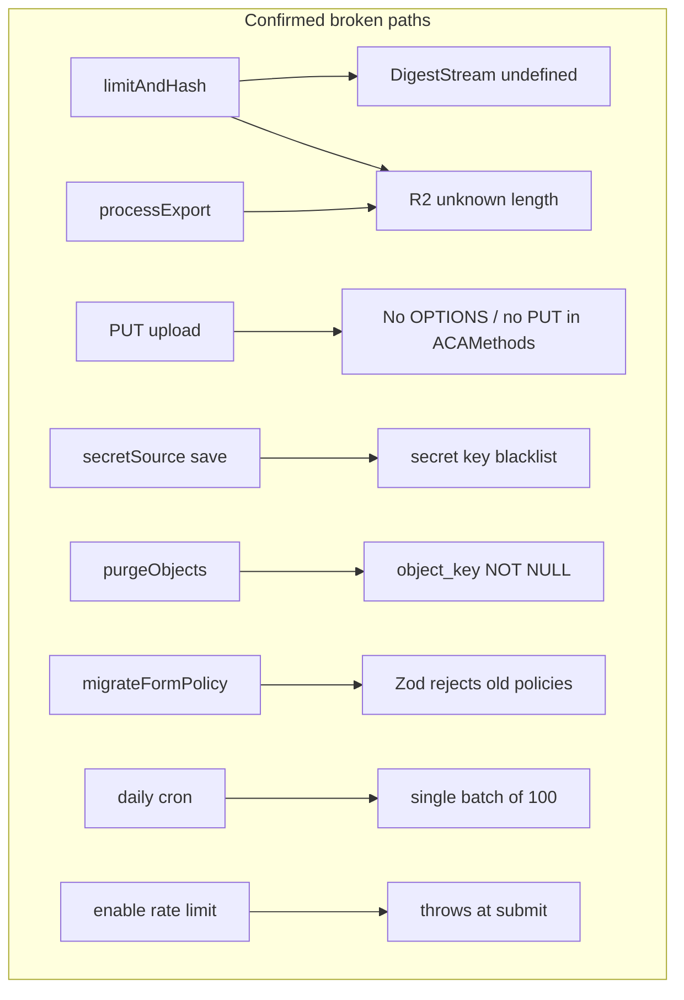

# Audit verification and P1 remediation

## Verification verdict

Independent code review (and prior Miniflare probes cited in your audit) **confirms every claim under 1a and 1b**. No false positives found.

| Finding | Verdict | Evidence |
|---|---|---|
| Upload `DigestStream` + lost stream length | **Confirmed** | [`limited-stream.ts`](app/lib/uploads/limited-stream.ts) uses bare `new DigestStream(...)`; both inline and direct paths call it; no `FixedLengthStream` |
| Export R2 unknown-length stream | **Confirmed** | [`process-export.server.ts`](app/lib/delivery/process-export.server.ts) `TransformStream.readable` → `R2.put`; fake in [`export-stream.test.ts`](app/lib/delivery/export-stream.test.ts) |
| Cross-origin direct uploads / CORS | **Confirmed** | File + complete routes lack OPTIONS; [`resolveCorsHeaders`](app/lib/submissions/validate-origin.ts) only allows `POST, OPTIONS` |
| CAPTCHA `secretSource` save blocked | **Confirmed** | `/secret\|password/i` key scan in [`settings.server.ts`](app/lib/form-config/settings.server.ts) before Zod |
| Form purge `object_key = NULL` | **Confirmed** | [`delete-form.server.ts`](app/lib/uploads/delete-form.server.ts) vs `NOT NULL` in [`0005_submission_platform.sql`](migrations/0005_submission_platform.sql); completion ignores exports |
| Policy migrate is parse-only | **Confirmed** | [`migrate-config.ts`](app/lib/form-config/migrate-config.ts) only `FormPolicyV1Schema.parse` |
| Retention ≤100/category/day | **Confirmed** | [`BATCH_LIMIT = 100`](app/lib/retention/run-scheduled-maintenance.server.ts), single pass, daily cron |
| Rate limit without `IP_HASH_SECRET` | **Confirmed** | [`validatePolicyCapabilities`](app/lib/form-config/capabilities.server.ts) omits check; runtime throws in [`apply-rate-limit.server.ts`](app/lib/submissions/apply-rate-limit.server.ts) |
| Field editor remount key | **Confirmed** | `key={\`${index}-${field.name}\`}` in [`forms.$formId.settings.fields.tsx`](app/routes/forms.$formId.settings.fields.tsx) |
| Tests hide real contracts | **Confirmed** | Fake D1 accepts illegal UPDATE; fake R2 accepts arbitrary streams |

Architecture judgment stands: modular monolith + D1/outbox + R2 + async delivery remains appropriate. Recoverability and platform-contract tests are the next structural gap.

---

## Remediation approach (concrete choices)

### 1. Fix upload streaming (`limitAndHash`)

In [`app/lib/uploads/limited-stream.ts`](app/lib/uploads/limited-stream.ts):

- Use `new crypto.DigestStream("SHA-256")`.
- Return a body wrapped in `FixedLengthStream(expectedBytes)` when size is known.
- Direct uploads: expected size is the session’s `size_bytes` (already validated against `Content-Length`).
- Inline uploads: expected size is `file.size` (reject if stream bytes diverge).
- On cancel/error: abort digest writer, cancel pipeline, and delete any partial R2 object (callers already delete on size mismatch for direct uploads; keep that).

Add a Workers-aware test (or Miniflare probe in CI) that actually calls `R2.put` with the hashed pipeline — unit-only Node mocks are insufficient.

### 2. Fix CSV exports with multipart R2

In [`app/lib/delivery/process-export.server.ts`](app/lib/delivery/process-export.server.ts):

- Replace single `put(TransformStream)` with **R2 multipart upload**: `createMultipartUpload` → write bounded parts (~5 MiB) → `complete` / `abort` on failure.
- Update [`export-stream.test.ts`](app/lib/delivery/export-stream.test.ts) to assert multipart API usage (or run against emulated R2), not a permissive `put` that only reads the stream.

### 3. CORS for upload endpoints

- Extend [`resolveCorsHeaders`](app/lib/submissions/validate-origin.ts) to accept allowed methods per route (e.g. `PUT, OPTIONS` for byte upload; `POST, OPTIONS` for create/complete/submit).
- Add `loader` OPTIONS handlers to:
  - [`api.forms.$formId.uploads.$sessionId.files.$fileId.tsx`](app/routes/api.forms.$formId.uploads.$sessionId.files.$fileId.tsx)
  - [`api.forms.$formId.uploads.$sessionId.complete.tsx`](app/routes/api.forms.$formId.uploads.$sessionId.complete.tsx)
  mirroring the existing pattern on session create / submissions.

### 4. Allow CAPTCHA `secretSource` saves

In [`savePolicyRequest`](app/lib/form-config/settings.server.ts):

- Remove the substring key blacklist.
- Rely on `FormPolicyV1Schema` plus an explicit denylist of **credential-shaped values** only if still needed (e.g. reject unexpected keys like `password`, `secret`, `apiKey` that are not in the schema). Zod strip/strict mode is the primary gate; `secretSource` / `credentialId` remain allowed metadata.

### 5. Schema-compatible form purge

- Add a migration making `submission_files.object_key` **nullable** (exports already tolerate null), or alternatively mark purged rows with a dedicated status and delete keys without nulling — **chosen approach: nullable `object_key` + status unchanged**, matching export cleanup.
- In [`purgeDeletedForms`](app/lib/uploads/delete-form.server.ts), before `DELETE FROM forms`, require **both** remaining submission-file keys **and** remaining export keys to be zero.
- Fix [`delete-form.test.ts`](app/lib/uploads/delete-form.test.ts) to enforce NOT NULL (or run against migrated SQLite) so the regression cannot return.

### 6. Tolerant policy load/repair

Replace parse-only [`migrateFormPolicy`](app/lib/form-config/migrate-config.ts) with a real repair path for schema version 1:

- Raise `request.maxPayloadBytes` to the inline floor when uploads mode is inline and the stored value is below floor.
- Drop or neutralize patterns that fail the new matcher (record a repair note / soft warning rather than hard-failing load).
- Keep **strict** Zod validation on **new saves**; loads may auto-repair then optionally persist on next successful settings save.

Ensure settings loaders catch residual failures with a recoverable error UI (cannot leave forms permanently unopenable).

### 7. Retention drain under deadline

In [`run-scheduled-maintenance.server.ts`](app/lib/retention/run-scheduled-maintenance.server.ts):

- For each category, **loop** `BATCH_LIMIT` pages until empty or deadline.
- **Rotate** category start order across runs (e.g. store last-served category, or use day-of-year modulo) so earlier categories cannot permanently starve later ones.
- Keep backlog reporting; add a test that simulates >100 expirations and asserts multi-batch drain within a long enough deadline.

### 8. Rate-limit capability gate

- Restore `IP_HASH_SECRET` / `ipHashing` check in `validatePolicyCapabilities` when `rateLimit.enabled`.
- Gate the security settings UI on `capabilities.ipHashing` with an explanatory message (same pattern as captcha/email).

### 9. Field editor stable keys

In [`forms.$formId.settings.fields.tsx`](app/routes/forms.$formId.settings.fields.tsx): assign each editor row a stable client id (e.g. `crypto.randomUUID()` on add / hydrate), use that as React `key`, never `name`.

---

## Test / contract hardening (required with the fixes)

- Prefer SQLite-migrated schema or constraint-aware fakes for purge tests.
- Prefer real/emulated R2 length and multipart behavior for upload + export tests.
- Add regression tests: CAPTCHA save with `secretSource`, CORS OPTIONS on PUT route, rate-limit save without secret → 422, policy repair for old inline 50 KB configs.

Architectural follow-ups from your review (signup claim recovery, 100 MB body materialization, Workers vitest pool, deploy gates) are **out of scope for this remediation milestone** unless you expand it; they should follow once these P1s are green.

---

## Suggested implementation order

1. Uploads + CORS (unblocks real submissions)
2. CAPTCHA save + rate-limit capability (unblocks dashboard security config)
3. Export multipart + purge schema/export gate (unblocks background jobs / deletion)
4. Policy repair + retention drain (upgrade/ops correctness)
5. Field-editor key + test contract hardening
