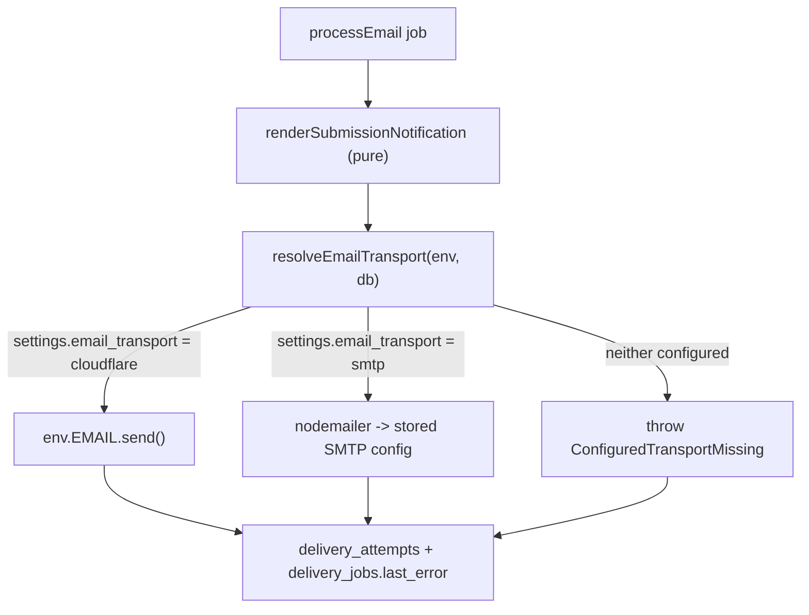

# FormZero NG: email delivery repair, Cloudflare config fixes, and audit remediation

## Why email is broken

Four independent defects stack up. Any one of them alone breaks notifications.

1. **Credentials cannot be saved without `FORMZERO_ENCRYPTION_KEY`.** The action in [app/routes/settings.notifications.tsx](app/routes/settings.notifications.tsx) returns 503 whenever a password is submitted and no key is present, so nothing is persisted. Your uncommitted `README.md` / `.dev.vars.example` changes call that key optional, and it was dropped from the deploy-button `bindings` in [package.json](package.json) — so a button-deployed instance can never configure email.

2. **Silent credential destruction on legacy rows.** `smtpSecretId` is seeded from `existingSettings.smtp_secret_id`. A legacy row with plaintext `notification_email_password` and `smtp_secret_id IS NULL` passes the `has_password` guard, then the UPDATE writes `smtp_secret_id = NULL, notification_email_password = NULL` and returns success. The password is gone.

3. **Raw SMTP from a Worker is the wrong transport.** [app/lib/email.server.ts](app/lib/email.server.ts) calls `nodemailer.createTransport()`. Nodemailer requires `net`, `tls`, `dns`, `fs`, `os`; Workers support `node:tls` only *partially* (`connect`, `TLSSocket`, `checkServerIdentity`, `createSecureContext`, shipped 2025-04-08) and `compatibility_date` in [wrangler.jsonc](wrangler.jsonc) is `2025-04-04`. Cloudflare's guidance is to not manage SMTP sockets from a Worker.

4. **The global "Send test email" button proves nothing.** [app/routes/settings.notifications.test.tsx](app/routes/settings.notifications.test.tsx) sends with the password straight from the POST body, never reading D1 or decrypting. A green test coexists with a queue that cannot decrypt anything. (The *per-form* test in [app/routes/forms.$formId.settings.notifications.tsx](app/routes/forms.$formId.settings.notifications.tsx) does correctly use `loadSmtpConfig`.)

Target architecture:



---

## Phase 1 — Email notifications and Cloudflare configuration

### 1a. Cloudflare config repair

In [wrangler.jsonc](wrangler.jsonc):

- **Delete `"migrations_dir": "../../migrations"`.** It resolves to `/home/robert/Work/Dev/migrations`, outside the repo, which breaks `npm run migrate` and the migrate step of `npm run deploy`. Migrations live in `./migrations`, which is wrangler's default.
- Bump `compatibility_date` from `2025-04-04` to a current date (`2026-08-04`). The current value predates `node:tls` support by four days.
- Add the Email Service binding:

```jsonc
"send_email": [{ "name": "EMAIL" }]
```

Deliberately **without** `"remote": true`. That flag makes local `wrangler dev` proxy sends to the real Email Service, so committing it would let any contributor running the dev server send real mail. Document it as an opt-in for deliberate end-to-end testing instead.

Keep `nodejs_compat`: nodemailer still backs the secondary SMTP transport (1c), so the flag cannot be dropped even though the primary path no longer needs it.

Also add `.github/workflows/ci.yml` running `npm ci && npm test && npm run typecheck && npm run build` — the audit found no CI at all. The config assertions it also runs are described in 1b-ter.

The README's manual-deploy resource names (`formzero`, `formzero-uploads`) currently disagree with the actual `formzero-ng` / `formzero-ng-uploads`, but do **not** simply realign them: 1b-bis removes those manual resource-creation steps altogether, which resolves the mismatch by deletion.

### 1a-bis. Drop `database_id` from version control

The committed real UUID `8aaa6829-…` is your account's database. A fork or a deploy-button clone must not inherit it, and on a first deployment the ID does not exist yet. Wrangler's [automatic resource provisioning](https://developers.cloudflare.com/workers/wrangler/configuration/) (open beta since 4.45.0; you have 4.114.0) exists precisely for this: *"resources will stay linked across future deploys even without adding the resource IDs to the config file. This is especially useful for shared templates."*

**Target shape** — keep the human-readable name, omit the ID:

```jsonc
"d1_databases": [
  { "binding": "DB", "database_name": "formzero-ng" }
]
```

R2 already needs no ID (`bucket_name` is sufficient), and Queues never had one, so D1 is the only binding to change.

**What I verified in `node_modules/wrangler/wrangler-dist/cli.js`**, rather than inferring from docs:

- D1 subcommands resolve the positional argument as *either* a binding name or a database name. With `database_name` present and `database_id` absent, `wrangler d1 migrations apply DB --remote` looks the database up by name through `GET /accounts/{id}/d1/database/{name}` and uses the returned uuid. So the `migrate` script keeps working without the ID.
- There is a dedicated error for the fully-unnamed case: *"Couldn't find an auto-provisioned D1 DB named '…' for binding 'DB'. Run 'wrangler deploy' to provision it, or add 'database_name' / 'database_id' to your config."* This is why the plan keeps `database_name` — it makes lookup deterministic instead of depending on the `<worker-name>-<binding>` auto-naming convention.
- At binding-metadata time, `if (database_id === void 0) throw 'DB bindings must have a "database_id" field'`, with `database_id ??= INHERIT_SYMBOL` applied **only** under `--dry-run`. So a real `wrangler deploy` without the ID depends on the provisioning step running first. If provisioning is disabled (`--no-x-provision`) or fails, deploy fails loudly with that message rather than binding to something wrong. That is acceptable behaviour, but it must be documented.

**Consequence: the deploy script order is currently wrong for a first deployment.** Today:

```
"deploy": "npm run build && npm run migrate -- --remote && wrangler deploy"
```

Migrate runs *before* deploy. Without a `database_id`, on a brand-new account the database does not exist when migrate runs, so the first deployment fails. Split the scripts in [package.json](package.json):

- `deploy:init` — `npm run build && wrangler deploy && npm run migrate -- --remote`. Provisions and binds the database, then applies migrations. Used once, for the very first deployment.
- `deploy` — keep `build && migrate --remote && deploy` for updates, where applying additive migrations before the new code goes live is the safe order.

Document which one to use when, and note that `deploy:init` briefly exposes the Worker against an unmigrated database — harmless on a fresh install with no users.

**Keeping the ID out of the repo afterwards.** Wrangler writes provisioned IDs back into the local config file, so the ID will reappear in `wrangler.jsonc` after your first local `wrangler deploy`. Since the binding stays linked without it, the write-back can simply be discarded. Add a CI step asserting `wrangler.jsonc` contains no `database_id`, so an accidental commit is caught rather than shipped to forkers.

**Two caveats to verify before committing to this.** The [deploy-button docs](https://developers.cloudflare.com/workers/platform/deploy-buttons/) say to *"include default values for resource names, resource IDs and any other properties for each binding"*, while also stating that dashboard-initiated deploys create resources whose *"IDs will only be accessible via the dashboard"* and are *"not written back to your repository"*. Those two statements are in tension. Verify with `npx wrangler deploy --dry-run` first, then one real button deployment into a scratch account, confirming that Workers Builds' `npm run deploy` resolves the database by name. If the button flow turns out to require an ID, the fallback is to keep `database_name` only in the repo and let the button's own configuration step fill the ID into the generated repository, which it already claims to do for newly created resources.

Also note `preview_database_id` is required only for `wrangler dev --remote`; this project develops against local D1, so it is not needed.

### 1b. Bindings become required; capabilities cover secrets only

**Decision: degraded deployments are not a supported configuration.** All bindings declared in `wrangler.jsonc` are guaranteed present at runtime, and every one of them is available on the Workers Free plan (Queues joined the free plan in February 2026 with 10,000 operations/day; R2 includes 10 GB). The optional-binding design bought nothing and cost correctness: the code half-commits to it, guarding in `processExport`, `runScheduledMaintenance` and `applyRateLimit` while leaving three route paths unguarded.

Delete the binding-level capability checks and use the generated `Env` directly.

**Remove the optional-binding plumbing:**

- [capabilities.server.ts](app/lib/form-config/capabilities.server.ts) — drop `uploads`, `backgroundDelivery` and `rateLimiting`, and the three matching errors in `validatePolicyCapabilities`. What remains is genuinely optional because it comes from secrets rather than bindings: `credentialEncryption` (`FORMZERO_ENCRYPTION_KEY`), `ipHashing` (`IP_HASH_SECRET`), `turnstile` (fixed in Phase 2), plus the new email-transport check, which is about domain onboarding and stored config rather than binding presence.
- Narrow `bucket?: R2Bucket` to `bucket: R2Bucket` in [delete-submission.server.ts](app/lib/uploads/delete-submission.server.ts), [cleanup-files.server.ts](app/lib/uploads/cleanup-files.server.ts), [inline-upload.server.ts](app/lib/uploads/inline-upload.server.ts) and [complete-upload.server.ts](app/lib/uploads/complete-upload.server.ts). The `bucket!` assertion at `delete-submission.server.ts:54` then disappears.
- Narrow `queue?: Queue` in [publish-jobs.server.ts](app/lib/delivery/publish-jobs.server.ts) and **delete its silent `if (!queue) return` no-op**, which is a bug in its own right: jobs stay `pending` forever with no error recorded.
- Drop the now-dead guards at `process-export.server.ts:18` and `run-scheduled-maintenance.server.ts:71`, and the `env as Env & { DELIVERY_QUEUE?: Queue; UPLOADS?: R2Bucket }` casts in [workers/app.ts](workers/app.ts).
- Drop the `capability_unavailable` branch in [apply-rate-limit.server.ts](app/lib/submissions/apply-rate-limit.server.ts); a missing rate-limit binding is now a deployment fault, not a user-facing submission error.
- The three previously unguarded sites (`forms.$formId.submissions.$submissionId.files.$fileId.tsx:22`, `forms.$formId.submissions.export.tsx:75`, `api.forms.$formId.uploads.$sessionId.files.$fileId.tsx:78`) become correct by construction.

**Still add a small `AppEnv`** in `app/lib/env.ts` — but for *secrets only*, since `wrangler types` cannot know about `wrangler secret put` values:

```ts
export type AppEnv = Env & {
  BETTER_AUTH_SECRET: string
  FORMZERO_ENCRYPTION_KEY?: string
  FORMZERO_PUBLIC_URL?: string
  TURNSTILE_SECRET?: string
  IP_HASH_SECRET?: string
}
```

This replaces the ad-hoc `env as Env & { FORMZERO_ENCRYPTION_KEY?: string }` casts that currently appear in at least six files.

### 1b-bis. Binding names are a contract, and the documented setup breaks it

The code reads `env.DB`, `env.UPLOADS`, `env.DELIVERY_QUEUE`, `env.RATE_LIMIT_STRICT|STANDARD|RELAXED` and (new) `env.EMAIL`. Those names must match `wrangler.jsonc` exactly. The README's current instructions actively produce the wrong ones.

Verified in the installed Wrangler: `wrangler d1 create` derives its binding name as `getValidBindingName(bindingName ?? db.name, "DB")`, and `getValidBindingName` only sanitizes the string — spaces and hyphens to underscores, invalid characters stripped — falling back to `"DB"` solely when nothing usable remains. So `npx wrangler d1 create formzero` yields binding **`formzero`**. Worse, `createdResourceConfig` does not just print a snippet: it prompts *"Would you like Wrangler to add it on your behalf?"* defaulting to yes, then *"What binding name would you like to use?"* defaulting to `formzero`, and writes it into `wrangler.jsonc` — appending a **second** `d1_databases` entry beside `DB`. Likewise `wrangler r2 bucket create formzero-ng-uploads` suggests `formzero_ng_uploads`, not `UPLOADS`.

The failure is silent today: a misnamed binding leaves `env.UPLOADS` undefined, `getCapabilities` reports `uploads: false`, and the dashboard says the feature simply is not configured. A configuration typo is indistinguishable from a deliberate omission — the same silent-outage shape as the email bug. Making bindings required removes the disguise, and the self-check below names the fault.

README changes:

- Remove the `wrangler d1 create` / `wrangler r2 bucket create` / `wrangler queues create` steps. Bindings are declared in `wrangler.jsonc` with fixed names, and `npm run deploy:init` provisions them (see 1a-bis). This is the second, independent reason to prefer auto-provisioning: the binding name becomes an input rather than an output.
- Document the exact binding names as a contract that must not be renamed, since renaming one silently disables a feature.
- If an operator insists on creating resources by hand, tell them to pass the binding name explicitly (`--binding DB`) and to decline Wrangler's offer to edit the config.

### 1b-ter. Platform self-check

Add `app/lib/platform/check-bindings.server.ts` exporting `checkPlatformBindings(env)`, returning one entry per expected binding with `present` and `usable` flags. Probe the method surface rather than mere truthiness — `typeof env.DB?.prepare === "function"`, `env.UPLOADS?.get`, `env.DELIVERY_QUEUE?.send`, `env.RATE_LIMIT_STRICT?.limit`, `env.EMAIL?.send` — so a name bound to the *wrong kind* of resource is caught too, not just an absent one.

Wire it into three places:

- A dashboard diagnostics panel listing each binding as usable, missing, or wrong type, naming the expected `wrangler.jsonc` key in the remedy text.
- One `console.error` per scheduled invocation when anything is missing, so it reaches Workers Logs (`observability.enabled` is already true). Daily cron makes this free.
- A `MisconfiguredBindingError` thrown from feature paths, carrying the expected binding name, instead of today's generic `capability_unavailable`.

Deliberately **not** throwing from the `fetch` handler for the whole app: bricking every request would hide the diagnosis rather than surface it. The dashboard panel plus named per-feature errors is loud and actionable. Compute the report per request — it is a handful of `typeof` checks — rather than memoizing env-derived state at module scope.

CI gets a companion assertion (add `jsonc-parser` as a devDependency, since `wrangler.jsonc` has comments) verifying that `wrangler.jsonc` declares exactly the expected binding names and that no `database_id` is committed. Note the queue *consumer* entry intentionally has no binding; only the producer does.

### 1c. Split rendering from transport

Refactor [app/lib/email.server.ts](app/lib/email.server.ts). The HTML/text builders (`formatSubmissionData`, `formatSubmissionDataText`, `formatValue`, `escapeHtml`) are transport-agnostic and stay. Extract:

- `app/lib/email/render.server.ts` — `renderSubmissionNotification(data)` returns `{ subject, html, text, to, replyTo, from }`.
- `app/lib/email/transport.server.ts` — `resolveEmailTransport({ env, db })` returns a `{ kind, send(message) }` object, or `null`.
- `app/lib/email/send-cloudflare.server.ts` — `env.EMAIL.send({ to, from: { email, name }, replyTo, subject, html, text })`. Map thrown `error.code` values to retryable vs terminal: `E_RATE_LIMIT_EXCEEDED`, `E_DELIVERY_FAILED`, `E_INTERNAL_SERVER_ERROR` retry; `E_SENDER_NOT_VERIFIED`, `E_VALIDATION_ERROR`, `E_FIELD_MISSING` are terminal and must not burn all five attempts. Note the 50-recipient cap.
- `app/lib/email/send-smtp.server.ts` — the existing nodemailer path, unchanged in behaviour.

Then [app/lib/delivery/process-email.server.ts](app/lib/delivery/process-email.server.ts) replaces its `loadSmtpConfig` + `sendSubmissionNotification` pair with `resolveEmailTransport`, and throws a distinguishable error when no transport is configured. Feed the terminal/retryable distinction into [app/lib/delivery/process-job.server.ts](app/lib/delivery/process-job.server.ts), which currently retries everything up to `retryDelays.length`.

### 1d. Transport selection and settings storage

**The sender address is a gap, not just a preference.** `env.EMAIL.send()` requires a `from` address on a domain onboarded to Email Sending. The only sender the schema stores today is `notification_email` — the SMTP *username*, typically the operator's own mailbox such as `me@gmail.com` — or `smtp_from_address`, which no code ever writes. Sending from either under the Cloudflare transport fails with `E_SENDER_NOT_VERIFIED` on every attempt. So the sender must become an explicit, transport-independent field.

New migration `migrations/0006_email_transport.sql`:

```sql
ALTER TABLE settings ADD COLUMN email_transport TEXT NOT NULL DEFAULT 'cloudflare';
ALTER TABLE settings ADD COLUMN email_from_address TEXT;
ALTER TABLE settings ADD COLUMN email_from_name TEXT;
```

Backfill `email_transport = 'smtp'` for any existing row that already has `smtp_host` set, so current installs keep their behaviour, and backfill `email_from_address` from `notification_email` for those rows to preserve today's effective sender. The unused `smtp_from_address` / `smtp_from_name` columns are superseded; stop reading them in [smtp-config.server.ts](app/lib/delivery/smtp-config.server.ts) and drop them in a later migration once no deployment references them.

Note the resulting semantics, which are worth making explicit in the UI: `notification_email` keeps two jobs it already has — SMTP username and fallback recipient when a form lists none — while `email_from_address` becomes the envelope sender for both transports.

In [app/routes/settings.notifications.tsx](app/routes/settings.notifications.tsx):

- **Fix the wipe bug.** Only clear `notification_email_password` when a new secret was actually written in this request. When `notification_email_password` is blank, leave both credential columns untouched rather than including them in the `SET` list.
- Add the transport radio (Cloudflare / custom SMTP).
- **Make validation transport-conditional.** The action currently hard-requires `notification_email`, `smtp_host` and a valid port for every save. Under the Cloudflare transport none of those apply: the required field is `email_from_address`, and the encryption-key gate does not fire at all. Under SMTP, host/port/credentials stay required as today and `email_from_address` defaults to `notification_email` when blank.
- When custom SMTP is chosen and `FORMZERO_ENCRYPTION_KEY` is absent, return a clear, actionable error naming the key and the `wrangler secret put` command.

Because a fresh install has no `settings` row at all, email stays unavailable until the sender address is saved — which is correct, and is what `validatePolicyCapabilities` should report in 1e rather than letting a form enable notifications that cannot send.

In [app/components/settings-dialog.tsx](app/components/settings-dialog.tsx), add the transport toggle and make sure `fetcher.data.error` is rendered (the 503 must be visible, not swallowed).

Replace the misleading global test: change [app/routes/settings.notifications.test.tsx](app/routes/settings.notifications.test.tsx) to test the **stored and resolved** transport via `resolveEmailTransport`, so a passing test means the queue will also succeed.

### 1e. Capabilities and pre-flight guards

In [app/lib/form-config/capabilities.server.ts](app/lib/form-config/capabilities.server.ts):

- Add `credentialEncryption: Boolean(env.FORMZERO_ENCRYPTION_KEY)`.
- Email availability is **not** `Boolean(env.EMAIL)` — per 1b the binding is always present. It is a *configuration* question: for the Cloudflare transport, whether the sender domain is onboarded; for SMTP, whether a usable stored config exists. Since domain onboarding cannot be probed from inside the Worker, treat email as available when `settings.email_transport` resolves to a transport that `resolveEmailTransport` can build, and let a genuine `E_SENDER_NOT_VERIFIED` at send time surface as a named, non-retryable error in the delivery log.
- In `validatePolicyCapabilities`, reject `policy.notifications.enabled` when `resolveEmailTransport` yields nothing, replacing today's `DELIVERY_QUEUE`-only check. A form can currently enable notifications with no way to send.

Surface this on the settings page ([app/routes/forms.$formId.settings.tsx](app/routes/forms.$formId.settings.tsx)), which currently shows only queue status and an aggregate `Failed delivery: N`. The binding-presence half of that display moves to the 1b-ter diagnostics panel.

### 1f. Diagnostics

Email failures are recorded in `delivery_jobs.last_error` but there is no UI for them — webhooks get a per-target error display, email gets nothing. Add a delivery-log view listing recent `notification_email` jobs with `status`, `attempt_count`, `last_error`, and a manual retry that resets `status = 'pending'` and republishes. This is what turns the next failure into a five-second diagnosis.

### 1g. Docs and deploy metadata

- Restore `FORMZERO_ENCRYPTION_KEY` to the `cloudflare.bindings` block in [package.json](package.json).
- In [README.md](README.md) and [.dev.vars.example](.dev.vars.example), state precisely what the key is required for: custom SMTP credentials, per-form Turnstile secrets, and webhook signing secrets. With the Cloudflare transport it is genuinely not needed for email — that is a real improvement worth documenting.
- Document `npx wrangler email sending enable <domain>` as the one-time prerequisite for the `EMAIL` binding, and note the SPF/DKIM/DMARC implications.
- Document the [Email Sending plan limits](https://developers.cloudflare.com/email-service/platform/pricing/): sending to **verified destination addresses in your own account is free on all plans**, but sending to *arbitrary* recipients requires Workers Paid (3,000 emails/month included). Form notifications usually go to the operator's own address, so the free path covers the common case — but a form configured with third-party recipients on a free account will fail, and the error must say so rather than surfacing a raw `E_*` code.

### 1h. Tests

No test currently covers `loadSmtpConfig`, `processEmail`, or any send path. Add:

- `loadSmtpConfig`: missing key with a `smtp_secret_id` returns `null`; legacy plaintext migrates when a key is present; **regression test for the wipe bug** — save with a blank password against a legacy row must preserve the credential.
- `resolveEmailTransport`: selection is driven by `settings.email_transport`, not by binding presence (the `EMAIL` binding is always bound per 1b). Cover: `'cloudflare'` with a sender address configured; `'smtp'` with a decryptable stored config; `'smtp'` with no encryption key returns `null`; and a missing `settings` row returns `null`.
- `processEmail` against a fake transport: recipients, subject template substitution, reply-to resolution, and terminal-vs-retryable error classification.

### 1i. Verification

`npm run migrate` (proves the `migrations_dir` fix), `npm test`, `npm run typecheck`, `npm run build`, and `npx wrangler deploy --dry-run` (proves the config still resolves without `database_id`). Then a live end-to-end submission with `npx wrangler tail` open, confirming `delivery_jobs.status = 'completed'`.

---

## Phase 2 — Audit P1 release blockers

All six were re-verified as still present.

1. **Turnstile capability is wrong.** `capabilities.server.ts:23-24` treats `FORMZERO_ENCRYPTION_KEY` as a Turnstile secret. Enabling Turnstile must require a form-owned credential, a newly supplied secret, or a confirmed global `TURNSTILE_SECRET`. Touches [schema.ts](app/lib/form-config/schema.ts) (`captchaSchema` validates `siteKey` but no secret), [forms.$formId.settings.security.tsx](app/routes/forms.$formId.settings.security.tsx) (allows a blank secret on first enable), and [verify-turnstile.server.ts](app/lib/submissions/verify-turnstile.server.ts) (then rejects every submission).
2. **Inline upload limits contradict the request limit.** Defaults are 50 KB request body vs 10 MB per file ([defaults.ts](app/lib/form-config/defaults.ts)), and [parse-request.server.ts](app/lib/submissions/parse-request.server.ts) applies `maxPayloadBytes` to the whole multipart body before file validation. Add a `superRefine` requiring `request.maxPayloadBytes >= uploads.maxTotalBytes + overhead` when inline mode is on, and raise the limit from the uploads settings UI.
3. **Unbounded buffering.** `parse-request.server.ts` accumulates chunks then copies into a second `Uint8Array`; direct upload uses `request.arrayBuffer()`; inline uses `file.arrayBuffer()`; the schema permits 100 MB. Stream into R2 through a byte-limiting `TransformStream`, reject oversized `Content-Length` early while still enforcing a streamed-byte cap, and lower inline limits.
4. **Webhook secrets are never shown.** [forms.$formId.settings.webhooks.tsx](app/routes/forms.$formId.settings.webhooks.tsx) generates, encrypts, and returns only `{ success: true }`. Show the plaintext exactly once after creation and rotation with copy support and a "cannot be recovered" warning.
5. **Retention is coupled and capped.** [run-scheduled-maintenance.server.ts](app/lib/retention/run-scheduled-maintenance.server.ts) runs every category sequentially with no try/catch, so one failure skips the rest; caps are 100/run in [cleanup-files.server.ts](app/lib/uploads/cleanup-files.server.ts) and [cleanup-expired.server.ts](app/lib/retention/cleanup-expired.server.ts). Isolate each category, paginate to a time budget, persist continuation state, emit backlog counts.
6. **Initial-admin race.** [api.auth.$.tsx](app/routes/api.auth.$.tsx) counts users then signs up. Enforce a singleton via a DB constraint or a one-time setup token.

---

## Phase 3 — P2 and remaining correctness findings

- Direct upload consumes submission rate limit twice ([api.forms.$formId.uploads.tsx](app/routes/api.forms.$formId.uploads.tsx) and [api.forms.$formId.submissions.tsx](app/routes/api.forms.$formId.submissions.tsx)), so a 5/min limit allows two submissions.
- Min-fill-time is bypassed when `_fz_started_at` is omitted — `minimumTimePassed` stays `undefined` in [validate-honeypot.ts](app/lib/submissions/validate-honeypot.ts).
- Schema permits required file fields with uploads disabled, and more file fields than `maxFiles`.
- Admin regexes run against public input in [validate-fields.ts](app/lib/submissions/validate-fields.ts) (ReDoS); move to a restricted grammar or RE2.
- `Date.parse` normalizes impossible dates instead of rejecting them.
- Form deletion is synchronous and N+1 in [delete-submission.server.ts](app/lib/uploads/delete-submission.server.ts); make it a tombstoned background job.
- Delivery reads the *current* policy at processing time; snapshot delivery config at enqueue, or document that late edits apply.
- Add DLQ visibility for `formzero-deliveries-dlq`, which has no consumer or monitoring.
- Track or upgrade the high-severity React Router advisory ([GHSA-qwww-vcr4-c8h2](https://github.com/advisories/GHSA-qwww-vcr4-c8h2)); RSC mode appears unused, so exposure is likely limited.