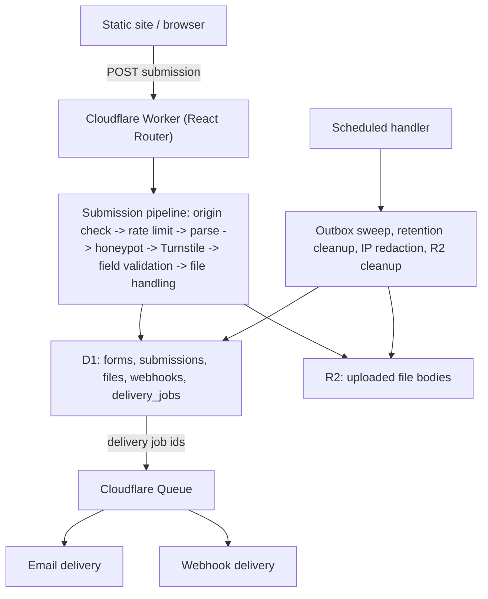

# Submission Policy and Delivery Platform

## 1. Current state (grounded in this repo)

- Public submission endpoint [app/routes/api.forms.$formId.submissions.tsx](app/routes/api.forms.$formId.submissions.tsx): returns `Access-Control-Allow-Origin: *`, accepts any JSON/urlencoded/multipart body, uses `Object.fromEntries(formData)` (silently collapses repeated field names and drops `File` bodies), has no field validation, no payload-size limit, no CAPTCHA/honeypot/rate limiting, and honors an attacker-controlled `?redirect=` query param.
- **Critical bug**: [app/routes/settings.notifications.tsx](app/routes/settings.notifications.tsx) loader runs `SELECT * FROM settings WHERE id = 'global'` with **no `requireAuth()` call**, returning the plaintext SMTP password to any unauthenticated request. The action correctly calls `requireAuth`, but the loader does not.
- `smtp_secure` is stored in the `settings` table but never read by [app/lib/email.server.ts](app/lib/email.server.ts) when building the Nodemailer transport.
- `forms` table ([migrations/0001_create_submissions_table.sql](migrations/0001_create_submissions_table.sql)) only has `id, name, created_at, updated_at`; [app/types/form.ts](app/types/form.ts) mirrors this. There is no per-form policy of any kind.
- `submissions` table stores only `id, form_id, data (TEXT JSON, no validation), created_at` with no request context, status, or retention fields.
- Notification recipients are a single global email address ([migrations/0004_move_to_global_settings.sql](migrations/0004_move_to_global_settings.sql)); there is no per-form recipient list and no webhook support.
- [app/routes/forms.$formId.submissions.tsx](app/routes/forms.$formId.submissions.tsx) loads **every** submission row for a form, `JSON.parse`s all of them, and computes stats/chart buckets/CSV export entirely in Worker memory — no pagination.
- [app/routes/forms.$formId.submissions/columns.tsx](app/routes/forms.$formId.submissions/columns.tsx) discovers table columns by scanning loaded submission objects rather than a configured field list.
- The Worker ([workers/app.ts](workers/app.ts)) only exports `fetch`; there is no `queue` or `scheduled` handler, and [wrangler.jsonc](wrangler.jsonc) only declares a `DB` D1 binding — no R2, Queues, or Rate Limiting bindings exist.
- There is no runtime schema library (no Zod or similar) and no test runner configured in [package.json](package.json). (Note: [app/routes/settings.notifications.test.tsx](app/routes/settings.notifications.test.tsx) is not a test file despite its name — it is the registered `/settings/notifications/test` route that sends test emails, and it does call `requireAuth`.)
- The settings UI depends on the leaking loader contract: [app/components/app-sidebar.tsx](app/components/app-sidebar.tsx) fetches `/settings/notifications` and [app/components/settings-dialog.tsx](app/components/settings-dialog.tsx) pre-fills its password input from `settings.notification_email_password`, so the P0 fix must also change these consumers (and [app/types/settings.ts](app/types/settings.ts)).
- [seed.sql](seed.sql) inserts rows against the current minimal `submissions` schema and must be updated alongside the schema rebuild.

## 2. Target architecture



The existing single Worker stays as the only deployable unit. [workers/app.ts](workers/app.ts) gains `queue` and `scheduled` exports alongside the existing `fetch`.

## 3. Data model changes

All new tables/columns ship as numbered files in `migrations/`, continuing from `0004`.

### 3.1 `forms`
Add columns:
- `config_json TEXT NOT NULL DEFAULT '{}' CHECK (json_valid(config_json))`
- `config_schema_version INTEGER NOT NULL DEFAULT 1`
- `config_revision INTEGER NOT NULL DEFAULT 1`

Existing forms are backfilled with a **legacy-compatible policy** (`rejectUnknownFields: false`, no configured fields, origins unrestricted, all security features disabled) so current integrations keep working; the dashboard flags these forms as "Legacy unrestricted policy — configure before production use."

Saves use optimistic concurrency:
```sql
UPDATE forms
SET config_json = ?, config_schema_version = ?, config_revision = config_revision + 1, updated_at = ?
WHERE id = ? AND config_revision = ?;
```
Zero rows changed means another session edited the form concurrently; the dashboard surfaces this as a conflict.

### 3.2 `submissions` (rebuilt, not just altered)
Because the current table has no JSON validation and a narrow column set, replace it via create-copy-drop rather than `ALTER TABLE`:
```sql
CREATE TABLE submissions_new (
  id TEXT PRIMARY KEY,
  form_id TEXT NOT NULL,
  request_id TEXT NOT NULL UNIQUE,
  config_revision INTEGER NOT NULL,
  status TEXT NOT NULL DEFAULT 'accepted'
    CHECK (status IN ('accepted','spam','pending_files','pending_delete','failed')),
  data TEXT NOT NULL CHECK (json_valid(data)),
  metadata_json TEXT NOT NULL DEFAULT '{}' CHECK (json_valid(metadata_json)),
  source_ip TEXT,
  source_ip_hash TEXT,
  source_origin TEXT,
  country_code TEXT,
  cf_ray TEXT,
  user_agent TEXT,
  created_at INTEGER NOT NULL,
  processed_at INTEGER,
  ip_delete_after INTEGER,
  delete_after INTEGER,
  FOREIGN KEY (form_id) REFERENCES forms(id) ON DELETE CASCADE
);
CREATE INDEX idx_submissions_form_created ON submissions_new(form_id, created_at DESC, id DESC);
CREATE INDEX idx_submissions_request_id ON submissions_new(request_id);
CREATE INDEX idx_submissions_status ON submissions_new(form_id, status, created_at DESC);
CREATE INDEX idx_submissions_ip_hash ON submissions_new(form_id, source_ip_hash);
CREATE INDEX idx_submissions_retention ON submissions_new(delete_after) WHERE delete_after IS NOT NULL;
CREATE INDEX idx_submissions_ip_retention ON submissions_new(ip_delete_after) WHERE ip_delete_after IS NOT NULL;
```
Before migrating, run `SELECT id FROM submissions WHERE NOT json_valid(data)` and abort the migration if any rows fail — those must be repaired manually first. Copy remaining rows with `request_id = 'legacy-' || id`, `config_revision = 0`, `status = 'accepted'`, `metadata_json = '{}'`. Rename tables and drop the old one only after copy succeeds. Update [app/types/submission.ts](app/types/submission.ts) and [seed.sql](seed.sql) (which inserts against the old column set) to match.

### 3.3 New tables
- `form_secrets(id, form_id, purpose, encrypted_value, created_at, updated_at)` — AES-GCM encrypted using a new `FORMZERO_ENCRYPTION_KEY` Worker secret (introduced in P3). Holds Turnstile secret keys and webhook signing secrets. The existing plaintext `notification_email_password` column on `settings` is migrated into this mechanism **in P3** (once encryption exists), and the plaintext column is dropped then. In P0 the password stays where it is but is never again returned to the browser.
- `form_webhooks(id, form_id, url, enabled, secret_id, event_types, timeout_ms, created_at, updated_at)` with FKs to `forms` and `form_secrets`.
- `delivery_jobs(id, kind, form_id, submission_id, target_id, status, attempt_count, available_at, locked_at, completed_at, response_status, last_error, created_at, updated_at)` — one table for both `notification_email` and `webhook` kinds, indexed on `(status, available_at)`.
- `upload_sessions(id, form_id, status, origin, expires_at, created_at)` for direct-upload flow.
- `submission_files(id, form_id, submission_id, upload_session_id, field_name, object_key, original_name, mime_type, size_bytes, checksum, status, created_at, delete_after)` — metadata only; bodies live in R2.

### 3.4 `settings` table and notifications loader corrections (P0)
- Add `requireAuth()` to the [app/routes/settings.notifications.tsx](app/routes/settings.notifications.tsx) loader and replace `SELECT *` with an explicit column list that returns `notification_email_password IS NOT NULL AS has_password` instead of the password itself.
- Update [app/types/settings.ts](app/types/settings.ts) (`Settings` gains `has_password: boolean`, drops the password) and [app/components/settings-dialog.tsx](app/components/settings-dialog.tsx): the password input becomes write-only (never pre-filled; shows a "password is set" state when `has_password` is true), and the save action treats an empty password as "keep existing" so users can update other SMTP fields without re-entering it.
- Fix `smtp_secure`: read it into the Nodemailer `secure` option in [app/lib/email.server.ts](app/lib/email.server.ts) (currently stored but ignored), and stop hardcoding `smtp_secure = 1` on save in the settings action.
- Remove the `notification_email_password` plaintext column in P3, once migrated to encrypted storage (Section 3.3).

## 4. Form policy model

New module `app/lib/form-config/types.ts` defines the versioned policy:
```ts
export interface FormPolicyV1 {
  schemaVersion: 1
  fields: FieldRule[]
  request: {
    maxPayloadBytes: number
    rejectUnknownFields: boolean
    allowedContentTypes: Array<"application/json" | "application/x-www-form-urlencoded" | "multipart/form-data">
  }
  security: {
    allowedOrigins: string[]
    allowMissingOrigin: boolean
    captcha: { enabled: false } | { enabled: true; provider: "turnstile"; siteKey: string; credentialId: string; expectedAction?: string }
    honeypot: { enabled: boolean; fieldName: string; startedAtFieldName?: string; minimumFillTimeMs?: number; response: "reject" | "accept-and-discard" }
    rateLimit: { enabled: false } | { enabled: true; profile: "strict" | "standard" | "relaxed"; key: "ip" | "ip-and-form" }
  }
  privacy: {
    ipMode: "full" | "hashed" | "none"
    ipRetentionDays: number | null
    storeUserAgent: boolean
    storeReferer: boolean
    geoPrecision: "none" | "country" | "region"
  }
  notifications: { enabled: boolean; recipients: string[]; replyToField?: string; subjectTemplate?: string }
  uploads: { enabled: boolean; mode: "inline" | "direct"; maxFiles: number; maxFileBytes: number; maxTotalBytes: number; allowedMimeTypes: string[]; allowedExtensions: string[] }
  retention: { submissionsDays: number | null; filesDays: number | null }
  redirects: { successUrl?: string; errorUrl?: string; allowedOrigins: string[] }
}

export interface FieldRule {
  name: string
  label?: string
  type: "string" | "email" | "url" | "tel" | "number" | "boolean" | "date" | "datetime" | "select" | "string-array" | "file" | "files"
  required: boolean
  trim?: boolean
  minLength?: number
  maxLength?: number
  minimum?: number
  maximum?: number
  pattern?: string
  options?: string[]
}
```
A field's presence in `fields` is what makes it allowed — there are no separate `allowedFields`/`requiredFields` arrays, eliminating the possibility of a required-but-not-allowed contradiction. `fields` is stored as an ordered array (not a keyed map) so the dashboard and integration examples can preserve field order and use labels.

Reserve the `_fz_` field-name namespace (`_fz_honeypot`, `_fz_started_at`, `_fz_upload_tokens`, `_fz_idempotency`, `_fz_redirect`) plus `cf-turnstile-response` as internal fields that are stripped before validation/storage.

`app/lib/form-config/schema.ts` defines a Zod schema (`FormPolicyV1Schema`) with `superRefine` cross-field checks: unique field names, valid `replyToField`, file-type rules restricted to file fields, R2 capability required when uploads enabled, Turnstile credential required when captcha enabled, redirect origins matching configured URLs. This same schema validates dashboard input, the advanced JSON editor, data loaded from D1, and default policies — one source of truth. Add **Zod** as a new dependency.

`app/lib/form-config/migrate-config.ts` handles future `configSchemaVersion` upgrades (a no-op for v1, but establishes the pattern).

## 5. Backend module structure

Refactor the monolithic route into small, testable modules so [app/routes/api.forms.$formId.submissions.tsx](app/routes/api.forms.$formId.submissions.tsx) becomes a thin orchestrator:
```
app/lib/
  form-config/{defaults,schema,types,migrate-config,load-form-policy.server,save-form-policy.server}.ts
  submissions/{errors,parse-request.server,normalize-fields,validate-fields,validate-origin,validate-redirect,validate-honeypot,verify-turnstile.server,apply-rate-limit.server,create-submission.server,response.server}.ts
  uploads/{validate-file,object-key,inline-upload.server,create-upload-session.server,complete-upload.server,download-file.server,cleanup-files.server}.ts
  delivery/{create-jobs.server,publish-jobs.server,process-job.server,process-email.server,process-webhook.server,webhook-signature}.ts
  secrets/{encrypt.server,decrypt.server,secret-store.server}.ts
  retention/{cleanup-expired.server,calculate-delete-after}.ts
```

## 6. Submission processing pipeline

Order of operations in the rewritten action (cheapest checks first):
1. Resolve form + validated policy (`config_revision` included).
2. Resolve dynamic CORS headers from `security.allowedOrigins`.
3. Validate method/content-type against `request.allowedContentTypes`.
4. Reject based on declared `Content-Length` vs `request.maxPayloadBytes`.
5. Validate `Origin` header against policy (respecting `allowMissingOrigin`).
6. Apply coarse rate limit (Cloudflare Rate Limiting binding, per `<formId>:<hashedIp>` and `form:<formId>`).
7. Parse body with an enforced size limit; use `formData.getAll(name)` (not `Object.fromEntries`) so repeated values, checkbox groups, and multi-file fields survive.
8. Extract and strip `_fz_*` / `cf-turnstile-response` internal fields.
9. Evaluate honeypot + minimum fill time; on trigger with `accept-and-discard`, return a normal success response without creating a submission or delivery jobs.
10. Verify Turnstile via Siteverify (fail closed if verification is unavailable; remove the token before storing).
11. Validate/normalize fields against `FieldRule[]` (per-type rules: trim strings, validate email/url/tel syntax, parse numbers strictly, accept configured boolean literals, require ISO date/datetime, enforce `select` options, apply array item limits).
12. Validate/attach uploaded files (inline or via completed upload-session tokens).
13. Build backend-generated submission context (see Section 7) and insert submission + file metadata + delivery jobs in one `env.DB.batch()` (transactional; a failed statement rolls back the whole batch).
14. `ctx.waitUntil(publishPendingDeliveryJobs(...))` to push job IDs onto the Queue.
15. Return JSON success/error or a policy-validated redirect.

Structured error codes and status mapping (400 malformed, 403 origin/CAPTCHA, 404 form not found, 413 payload/file too large, 415 unsupported content type, 422 validation failed, 429 rate limited, 500 internal, 503 capability unavailable). JSON error responses use a consistent shape with per-field messages:
```json
{
  "success": false,
  "error": {
    "code": "validation_failed",
    "message": "The submission contains invalid fields.",
    "fields": { "email": "Enter a valid email address." },
    "requestId": "req_..."
  }
}
```
HTML-form error redirects carry only `?error=<code>&request_id=<id>` — never field values or internal detail.

## 7. Backend-generated submission context

Captured once at the top of the action as `receivedAt = Date.now()`, never trusting client-supplied timestamps:
- **Ordinary relational columns** (frequently filtered/joined/used for lifecycle): `request_id`, `created_at`, `processed_at`, `source_ip`, `source_ip_hash` (keyed HMAC via a new `IP_HASH_SECRET`, never an unkeyed hash), `source_origin`, `country_code`, `cf_ray`, `user_agent`, `delete_after`, `ip_delete_after`.
- **`metadata_json` flexible document**: request method/content-type/content-length/referer/accept-language, Cloudflare `request.cf` fields (colo, continent, regionCode, timezone, asn, asOrganization, httpProtocol, tlsVersion — all optional since `request.cf` is absent locally), security-processing results (origin accepted, captcha verified/hostname/action, honeypot triggered, rate-limit profile applied), and payload stats (encoding, field/file counts, byte totals).
- Never store: Turnstile tokens, SMTP passwords, webhook secrets, `Authorization`/cookie headers, raw header dumps, or R2 temp credentials. Never store city/postal/lat-long by default (country-level only, per `privacy.geoPrecision`).
- Use `CF-Connecting-IP` (not `X-Forwarded-For`) for the visitor IP, per the `privacy.ipMode` policy (`full` | `hashed` | `none`) with a separate, typically shorter, `ipRetentionDays`.

## 8. Origin, CORS, and redirect security

Replace the hardcoded `Access-Control-Allow-Origin: *` in [app/routes/api.forms.$formId.submissions.tsx](app/routes/api.forms.$formId.submissions.tsx) with dynamic per-request CORS that echoes back only an origin present in `security.allowedOrigins`, sets `Vary: Origin`, and treats missing-origin handling as an explicit, dashboard-visible policy choice (`allowMissingOrigin`). This applies to the OPTIONS preflight too: the current loader answers preflights with static wildcard headers, so it must load the form's policy and resolve the same dynamic CORS headers before responding. Origin checks remain an abuse-control layer, not authentication — non-browser clients can forge or omit the header.

Remove the current unrestricted `?redirect=` parameter handling entirely (both the query-string escape hatch in the submission route and the "Redirect URL" helper text field on [app/routes/forms.$formId.integration.tsx](app/routes/forms.$formId.integration.tsx)). Redirects become policy-defined `redirects.successUrl` / `redirects.errorUrl`, validated to require HTTPS (localhost allowed only in dev), match a configured allowed redirect origin, and reject protocol-relative or `javascript:`/`data:` schemes.

## 9. CAPTCHA, honeypot, and rate limiting

- **Turnstile**: server-side `siteverify` call with an idempotency UUID, hostname/action verification, fail-closed on verification-service errors. Site key lives in the form policy; the secret lives in `form_secrets` (encrypted) or a single global `TURNSTILE_SECRET` Worker secret for simpler deployments — the data model supports multiple credentials later via `credentialId`.
- **Honeypot**: default `{ enabled: true, fieldName: "_fz_honeypot", startedAtFieldName: "_fz_started_at", minimumFillTimeMs: 1500, response: "accept-and-discard" }`. `accept-and-discard` returns an ordinary success response but skips submission/job creation, hiding detection from simple bots.
- **Rate limiting**: add a Cloudflare Rate Limiting binding per profile (`strict`/`standard`/`relaxed`, e.g. 5/15/60 requests per 60s) in [wrangler.jsonc](wrangler.jsonc), keyed by `<formId>:<hashedClientIp>` plus a coarser `form:<formId>` key for distributed-attack protection. Treated as a fast, location-scoped, eventually-consistent first layer, not exact global accounting — a Durable Object can add strict global limits later if needed.

## 10. Notifications and webhooks

- Keep SMTP transport global (host/port/`secure`/username/password/from address/from name) but move per-form behavior into the policy (`notifications.recipients`, `replyToField`, `subjectTemplate`). Fix `secure` to actually be read into the Nodemailer transport in [app/lib/email.server.ts](app/lib/email.server.ts).
- Refactor the existing email renderer in [app/lib/email.server.ts](app/lib/email.server.ts) (its HTML-escaping helpers are kept): render configured field labels in configured order instead of raw key prettification, send to the per-form recipient list, set `replyTo` from a validated email-type field when `replyToField` is configured, apply the subject template, include file metadata with authenticated download links (never attach the files themselves by default), and continue escaping all submitted values.
- `form_webhooks` rows define destination URL, enabled state, HMAC-SHA256 signing secret (in `form_secrets`), and `event_types` (initially `["submission.created"]`).
- Webhook payload includes form/submission identity, submitted data, and file metadata (id/field/name/mimeType/size) — never a direct public R2 URL, since the bucket stays private.
- Sign the exact transmitted bytes: `FormZero-Signature: t=<ts>,v1=<hmac>` over `<timestamp>.<raw-body>`, plus `FormZero-Event` and `FormZero-Delivery` headers. Reject old timestamps on the receiving side (documented for integrators).
- Webhook delivery must require HTTPS outside dev, reject localhost/private/link-local destinations, disable automatic redirect following (or revalidate every hop), enforce a configurable timeout, and cap response-body reads.
- **Outbox pattern**: submission insert + file metadata + delivery-job rows all go into one `env.DB.batch()` so they're atomic; only after that commits does `ctx.waitUntil()` publish job IDs to the Cloudflare Queue. A scheduled sweeper republishes any `delivery_jobs` still `pending` past a grace period, covering the window where D1 commits but the Queue publish fails.
- Queue messages carry only `{ jobId: string }` — never submission PII — and consumers claim work with a conditional `UPDATE ... WHERE status IN ('pending','retry')` so redelivered/duplicate messages are safely no-ops.
- Retry progression: immediate, 1 min, 5 min, 30 min, 2 hours, then dead-letter queue. Add a `formzero-deliveries` queue + `formzero-deliveries-dlq` to [wrangler.jsonc](wrangler.jsonc).
- Dashboard supports manual retry of failed deliveries and shows delivery history per webhook.

## 11. R2 file uploads

- New `UPLOADS` R2 binding in [wrangler.jsonc](wrangler.jsonc); bucket stays **private** — no public bucket.
- Object keys are random, not user-controlled: `forms/<formId>/<year>/<month>/<fileId>` for attached files, `_tmp/<formId>/<uploadSessionId>/<fileId>` for in-flight direct uploads. Original filenames live only in `submission_files.original_name`.
- **Inline mode**: ordinary `multipart/form-data` HTML forms keep working; conservative defaults (10 MB/file, 25 MB total, 5 files max), validated for count/size/MIME allowlist/extension allowlist/filename sanitization/optional magic-byte checks. Objects are written with a temporary status and only marked `attached` after the D1 submission transaction succeeds (D1 and R2 can't share a transaction, so a scheduled job removes orphaned temp objects).
- **Direct mode** (new routes `POST /api/forms/:formId/uploads`, `PUT /api/forms/:formId/uploads/:sessionId/files/:fileId`, `POST /api/forms/:formId/uploads/:sessionId/complete`): browser requests an upload session, FormZero validates form/origin/limits/rate-limit and issues a short-lived authorization, browser uploads the file, then submits ordinary fields plus upload tokens that FormZero atomically attaches. Supports R2 multipart upload for larger files (up to 10,000 parts).
- New authenticated download route `GET /forms/:formId/submissions/:submissionId/files/:fileId`: requires dashboard auth via the existing [app/lib/require-auth.server.ts](app/lib/require-auth.server.ts) pattern, confirms file/submission/form linkage, streams from R2 with `Content-Disposition: attachment` and `X-Content-Type-Options: nosniff`, and avoids public caching.
- Deleting a submission or form that has attached files must not simply `DELETE` the D1 row first (current behavior in [app/routes/forms.$formId.submissions.$submissionId.tsx](app/routes/forms.$formId.submissions.$submissionId.tsx) and [app/routes/forms.$formId.settings.tsx](app/routes/forms.$formId.settings.tsx)): mark `pending_delete` → delete R2 objects → delete file metadata → delete delivery records → delete the row, retrying via scheduled maintenance if R2 deletion fails.

## 12. D1 JSON usage rules

Applies consistently across `forms.config_json`, `submissions.data`, and `submissions.metadata_json`:
- Use an ordinary relational column when a value is universal, frequently filtered/sorted, used for retention/operational state, joined, foreign-keyed, or needed to locate/delete an external resource (R2 object, delivery job).
- Use a JSON `TEXT` column (with `CHECK (json_valid(...))`) when a value is form-specific, structurally flexible, optional, usually read as a whole, or only occasionally queried by path.
- Validate/canonicalize with D1's `json()` function at insert time; query with `->>`, `json_extract()`, and `json_each()` for array membership checks; keep submitted `data` immutable after acceptance (only `config_json` and non-critical metadata are ever mutated in place via `json_set`/`json_patch`).
- Do not add per-form generated columns for arbitrary custom fields in this iteration — one generated-column definition applies to the whole table, and every form's fields differ; revisit only if a specific universal path becomes a proven hotspot.

## 13. Dashboard rebuild

### 13.1 Settings routes
Replace the single [app/routes/forms.$formId.settings.tsx](app/routes/forms.$formId.settings.tsx) with a layout + nested routes in [app/routes.ts](app/routes.ts):
```
/forms/:formId/settings                (layout)
  index          -> general (name, form id, redirects, delete form)
  fields         -> ordered field table (add/edit/reorder/duplicate/delete, reject-unknown toggle)
  security       -> origins, allow-missing-origin, Turnstile, honeypot, rate-limit profile
  notifications  -> enabled, recipient chips, reply-to (email fields only), subject template, test send
  webhooks       -> cards: URL, events, enabled, secret status, last delivery/status, test, rotate secret, history, manual retry
  uploads        -> enable, inline/direct mode, file fields, per-file/total/count limits, MIME/extension presets, retention, R2 capability status
  retention      -> submission/file/temp-upload retention presets + custom days, confirmation dialog showing affected-record counts when shortening existing data
  advanced       -> raw JSON editor validated by the same Zod schema, formatted, shows schema version + diff before save, rejects secret values, preserves optimistic-concurrency revision
```
Field-table validation must reject duplicate names, `_fz_`-prefixed names, invalid type/constraint combinations, required fields with unusable limits, and invalid regex patterns.

A capability-status indicator (R2 uploads / background delivery / rate limiting / Turnstile secret / retention cron: Configured vs Missing) gates which features a form is allowed to enable, based on which optional bindings (`UPLOADS`, `DELIVERY_QUEUE`, rate-limit bindings, `TURNSTILE_SECRET`) are actually present in `Env`.

### 13.2 Submissions dashboard scalability
Rework [app/routes/forms.$formId.submissions.tsx](app/routes/forms.$formId.submissions.tsx) to stop loading every row:
- Aggregate stats (total / this-week / this-month / trends) via SQL `SUM(CASE ...)` in one query instead of filtering an in-memory array.
- Daily chart via `GROUP BY date(created_at/1000,'unixepoch')` SQL, with the app only filling gaps in the 30-day range.
- Cursor-based pagination (`WHERE (created_at, id) < (?, ?) ORDER BY created_at DESC, id DESC LIMIT ?`) replacing the full unbounded `SELECT ... ORDER BY created_at DESC`.
- [app/routes/forms.$formId.submissions/columns.tsx](app/routes/forms.$formId.submissions/columns.tsx) derives columns from the form's configured `fields` policy (ordered, human-readable labels) instead of scanning loaded rows; legacy forms with no field policy fall back to a `json_each` distinct-key query.
- CSV export: small forms stream directly from an authenticated route; large exports become a background export job that writes CSV to R2 and offers a short-lived authenticated download link, rather than requiring every submission to be loaded client-side as today.

### 13.3 Integration page
[app/routes/forms.$formId.integration.tsx](app/routes/forms.$formId.integration.tsx) generates its HTML/JS examples from the form's actual policy: configured fields with `required`/`maxlength`/`min`/`max`/`accept`/`multiple`, honeypot markup, Turnstile widget script when enabled, correct `enctype` when uploads are enabled, and removes the free-text redirect-URL helper (replaced by a link to the General settings redirect fields). A new optional `GET /api/forms/:formId/public-config` route exposes only non-sensitive info (fields, captcha enablement + site key, upload limits) for building custom integrations — never recipients, webhook URLs, secrets, or retention settings.

## 14. Scheduled maintenance and retention

Extend [workers/app.ts](workers/app.ts):
```ts
export default {
  async fetch(request, env, ctx) { ... },
  async queue(batch, env, ctx) { await processDeliveryBatch(batch, env, ctx) },
  async scheduled(controller, env, ctx) { ctx.waitUntil(runScheduledMaintenance(env)) },
} satisfies ExportedHandler<Env, DeliveryQueueMessage>
```
Add a cron trigger to [wrangler.jsonc](wrangler.jsonc). Maintenance responsibilities: publish any unqueued delivery jobs (outbox sweep), unlock abandoned `processing` jobs, delete expired upload sessions and unattached temp R2 objects, redact `source_ip` where `ip_delete_after` has passed, delete expired R2 file objects (before their metadata rows), delete expired submissions, and record any cleanup failures for retry rather than losing them silently.

Retention timestamps (`delete_after`, `ip_delete_after`) are computed at submission time from the form's policy and are explicit columns, not derived at query time; changing a form's retention setting only affects new submissions unless the admin explicitly triggers a bulk re-apply from the Retention settings tab.

## 15. Configuration and secret validation

- Add **Zod** as the runtime schema library; `FormPolicyV1Schema` (Section 4) is the single source of truth used by dashboard forms, the advanced JSON editor, D1-loaded data, default policies, the public-config endpoint, and future migrations.
- Add AES-GCM encrypt/decrypt helpers in `app/lib/secrets/` backed by a new `FORMZERO_ENCRYPTION_KEY` Worker secret (P3), used for Turnstile secrets, webhook signing secrets, and the SMTP password migrated out of its plaintext column at that point.

## 16. Testing foundation

[package.json](package.json) currently has no test runner. Add Vitest with Cloudflare Workers test-pool support (`@cloudflare/vitest-pool-workers`) and a `test` script. Coverage priorities:
- Unit: policy schema/defaults/migrations, every field type's normalization, unknown-field handling, repeated-value parsing, payload-size enforcement, origin normalization, redirect validation, honeypot modes, Turnstile response mapping, file constraint validation, webhook signatures, retention date math, encrypt/decrypt round-trips.
- Integration: the rewritten submission route against local D1 (+ mocked Turnstile/SMTP/webhook receiver/R2), queue duplicate-delivery and retry/failure paths, cron cleanup.
- Security regressions specifically for this codebase's known issues: the notification-settings loader must require auth and never return the password; open-redirect attempts must be rejected; oversized JSON/multipart bodies must be rejected; reserved `_fz_` field names must be stripped; unauthenticated file-download attempts must 401/403; duplicate Queue delivery must not double-send.

## 17. Wrangler configuration additions

[wrangler.jsonc](wrangler.jsonc) grows to include: `r2_buckets` (`UPLOADS` → `formzero-uploads`), `queues.producers`/`consumers` (`DELIVERY_QUEUE` → `formzero-deliveries`, with a `formzero-deliveries-dlq` dead-letter queue, batch size 10, max retries 5), `ratelimits` (`RATE_LIMIT_STRICT`/`STANDARD`/`RELAXED`), and `triggers.crons` for the scheduled handler. New secrets via `wrangler secret put`: `FORMZERO_ENCRYPTION_KEY`, `TURNSTILE_SECRET` (optional global fallback), `IP_HASH_SECRET`. All new bindings on `Env` (`UPLOADS?`, `DELIVERY_QUEUE?`, rate-limit bindings, `TURNSTILE_SECRET?`, `FORMZERO_ENCRYPTION_KEY?`) are optional so the app keeps running with D1 alone in minimal deployments — a form simply cannot enable a feature whose binding is missing.

## 18. Phased delivery order

Work proceeds in the order below; each phase leaves the app deployable.

- **P0 — Immediate security corrections**: authenticate the notifications loader and stop ever returning the SMTP password (loader returns `has_password` only; update `Settings` type and the settings dialog's write-only password field per Section 3.4), fix `smtp_secure` wiring, remove/restrict the open `?redirect=` parameter, reject multipart requests containing `File` values until R2 exists, add security regression tests for all of the above. No new schema or dependencies required — deployable immediately.
- **P1 — Policy and metadata foundation**: Zod + form policy columns/schema, rebuilt submissions schema with backend-generated context (IP, origin, country, Ray ID, metadata JSON), D1 JSON validation, route refactor into the module structure in Section 5, structured errors, cursor pagination + SQL aggregates for the dashboard.
- **P2 — Abuse protection**: dynamic CORS, origin enforcement, safe redirects, honeypot, Turnstile, rate-limit profiles, capability-status detection, IP redaction schedule.
- **P3 — Durable delivery**: per-form notification recipients + email renderer refactor, encrypted secret storage (including migrating the SMTP password out of its plaintext column and dropping it), webhook definitions + signing, delivery-job outbox pattern, Cloudflare Queue consumer with retry/DLQ, delivery history and manual retry UI.
- **P4 — R2 uploads**: private bucket, file metadata tables, inline multipart uploads, authenticated download route, temp-object cleanup, direct upload sessions, R2-aware submission/form deletion.
- **P5 — Lifecycle and full dashboard**: scheduled maintenance handler, submission/file/IP retention with bulk re-apply, remaining settings tabs (fields/security/notifications/webhooks/uploads/retention/advanced), integration-page regeneration from policy, public-config endpoint, export jobs, storage/delivery monitoring.
